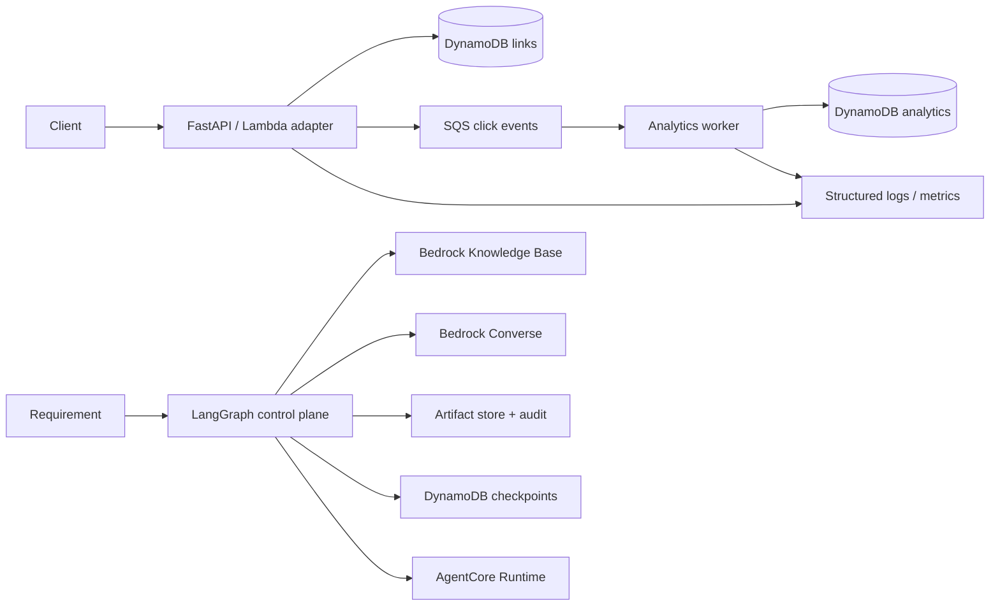
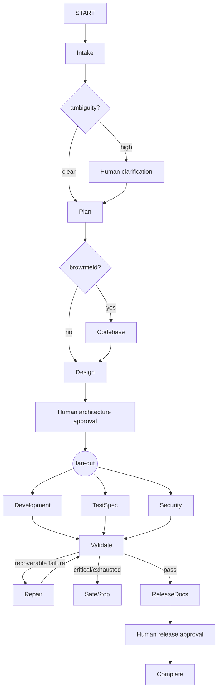

# LinkOps AI architecture

The product request path is intentionally short: link lookup, synchronous status and
expiry checks, sanitized event publication, and redirect. Analytics is asynchronous.

The control-plane graph is explicit:

Large artifacts live under `artifacts/<run_id>`; graph state carries typed metadata,
references, hashes, approvals, and audit events. No hidden model chain-of-thought is
persisted.
